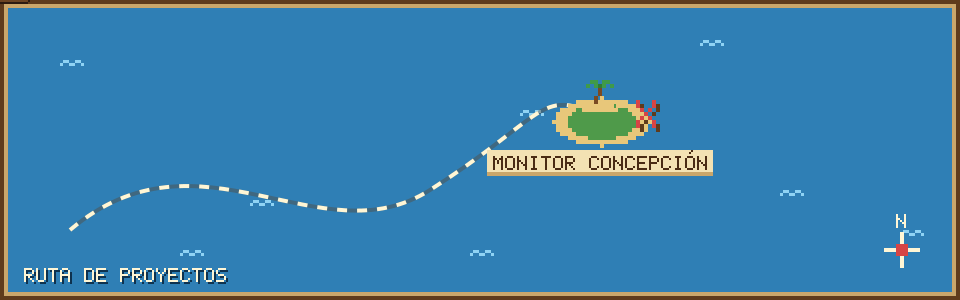

  

Soy geofísico de la Universidad de Concepción y cofundador de [MetGeo SpA](https://www.linkedin.com/company/metgeo-spa/). Construyo pipelines de datos en Python para información ambiental, desde la descarga y el control de calidad de series de estaciones y grillas netCDF hasta dashboards en Streamlit. Trabajo sobre el clúster NLHPC con modelos numéricos oceánicos y atmosféricos (CROCO y WRF). Usuario de linux.

Para programar uso Claude Code y OpenCode, con desarrollo guiado por especificaciones. Además de Python, he trabajado con MATLAB, SQL y Bash.

  

  

El proyecto del mapa es [monitor-meteo-concepcion](https://github.com/Heszo/monitor-meteo-concepcion). Compara lo observado en 17 sitios del Gran Concepción con 7 modelos globales y un ensamble de 143 miembros, y se actualiza cada hora con una GitHub Action. Se puede ver en línea en [metgeo-concepcion.streamlit.app](https://metgeo-concepcion.streamlit.app/).

Contacto: brunobastian.herrera@gmail.com. MetGeo está en [LinkedIn](https://www.linkedin.com/company/metgeo-spa/) y en [Instagram](https://www.instagram.com/metgeo.spa/).
